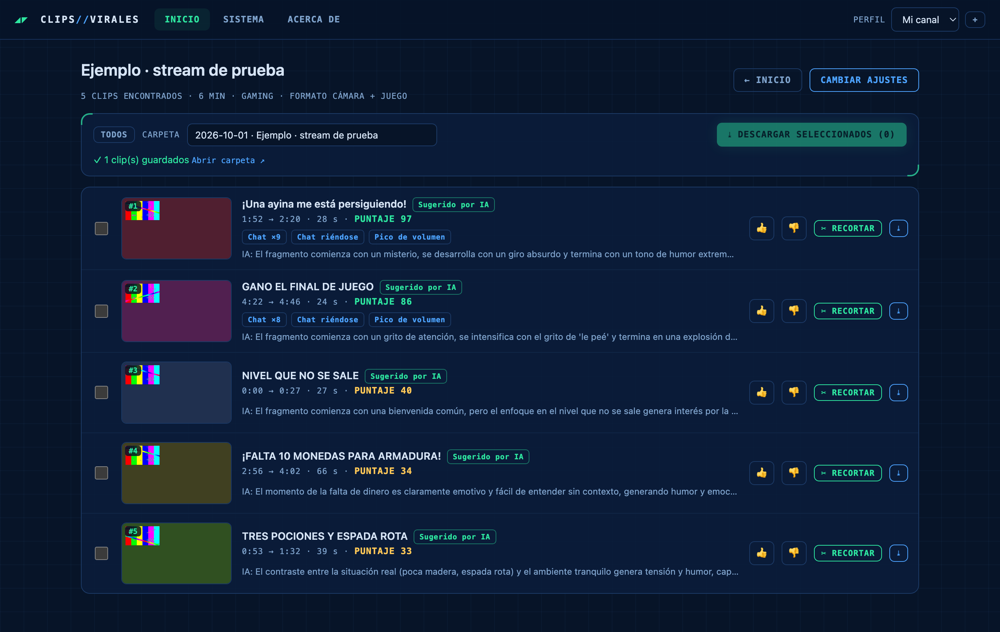
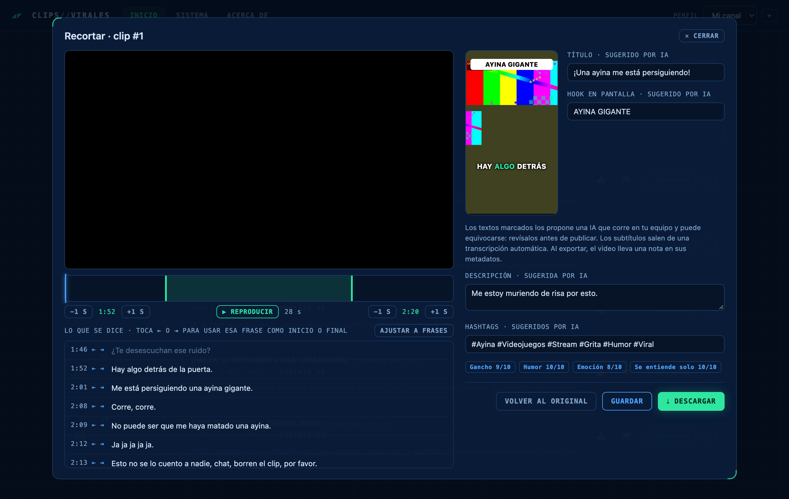
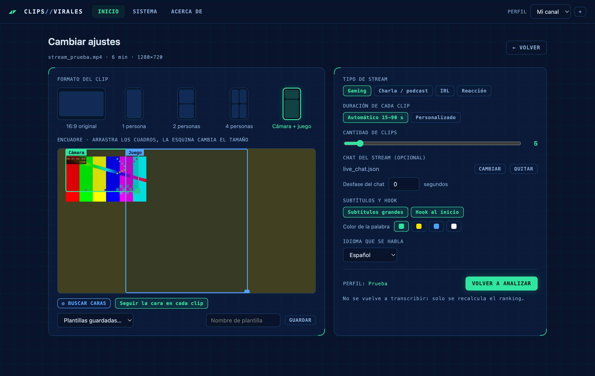
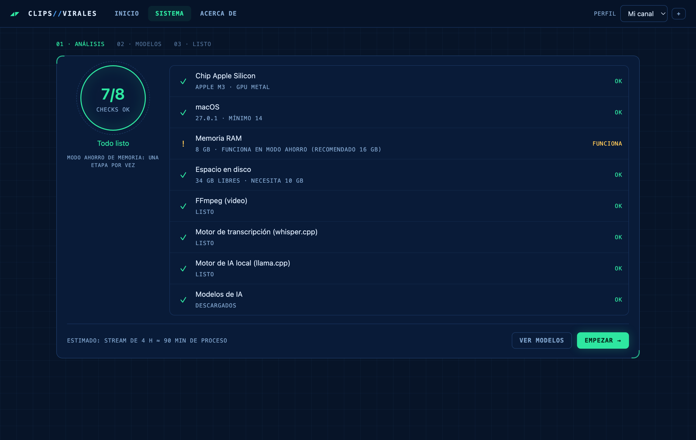

# Clips Virales · Descargas

Encuentra los mejores clips para TikTok, YouTube Shorts e Instagram Reels dentro de tus streams largos (de 1 a 8 horas). Todo se procesa en tu computadora, sin pagar APIs: tus videos nunca salen de ella. Solo la primera vez necesita internet, para descargar los modelos de IA (unos 3 GB); después funciona sin conexión.

## Así se ve

**Resultados:** los mejores momentos ordenados por puntaje, con el motivo de cada uno (chat, risas, gritos) y los textos sugeridos por IA.



**Editor de recorte:** línea de tiempo, lo que se dice frase por frase, vista previa vertical con hook y subtítulos.



<table>
<tr>
<td width="50%"><b>Configurar:</b> formato vertical (1, 2 o 4 personas, cámara + juego), encuadre, duración, chat y subtítulos.<br><br></td>
<td width="50%"><b>Sistema:</b> la app revisa tu equipo y te dice si puede funcionar antes de empezar.<br><br></td>
</tr>
</table>

Las capturas usan un stream de prueba generado para la demo.

## Descargar

| Sistema | Descarga | Requisitos |
|---|---|---|
| 🪟 **Windows 10 / 11** | [ClipsVirales-windows-setup.exe](https://github.com/ermandev7/clips-virales-descargas/releases/latest/download/ClipsVirales-windows-setup.exe) | 64 bits, 8 GB de RAM. Recomendado: tarjeta NVIDIA, AMD o Intel Arc |
| 🐧 **Linux** | [ClipsVirales-linux-x86_64.AppImage](https://github.com/ermandev7/clips-virales-descargas/releases/latest/download/ClipsVirales-linux-x86_64.AppImage) | Ubuntu 24.04 o equivalente, 8 GB de RAM |
| 🍎 **Mac** | Próximamente | Apple Silicon (M1 o más nuevo) |

Todas las versiones: [Releases](https://github.com/ermandev7/clips-virales-descargas/releases)

## Instalar con un comando

**Windows** (PowerShell):
```powershell
irm https://github.com/ermandev7/clips-virales-descargas/releases/latest/download/install.ps1 | iex
```

**Linux**:
```bash
curl -fsSL https://github.com/ermandev7/clips-virales-descargas/releases/latest/download/install.sh | sh
```

## La primera vez

1. Al abrir la app, el asistente revisa tu equipo y marca cada punto con ✓, ⚠ o ✕.
2. Te recomienda los modelos de IA según tu memoria y los descarga (unos 3 GB). Después funciona sin internet.
3. Abre tu video, configura los clips y listo.

**Windows puede mostrar "Windows protegió su PC"** porque la app todavía no tiene firma digital. Toca **Más información → Ejecutar de todas formas**.

## Inteligencia artificial

La app usa modelos de IA que corren en tu equipo para elegir los mejores momentos y sugerir títulos, hooks, descripciones y hashtags. Esas sugerencias pueden equivocarse: revísalas antes de publicar. Los videos exportados llevan una nota en sus metadatos que indica qué partes son sugeridas por IA.

## Licencia

Clips Virales es **gratis**, también para uso comercial: puedes usarla y publicar los clips que hagas con ella. No está permitido copiarla, modificarla ni redistribuirla. Ver [LICENSE](LICENSE).

¿Encontraste un problema o un fallo de seguridad? Abre un [issue](https://github.com/ermandev7/clips-virales-descargas/issues).

## Licencias de terceros

Clips Virales incluye [FFmpeg](https://ffmpeg.org) (GPL, compilación de [BtbN/FFmpeg-Builds](https://github.com/BtbN/FFmpeg-Builds)), [whisper.cpp](https://github.com/ggml-org/whisper.cpp) y [llama.cpp](https://github.com/ggml-org/llama.cpp) (MIT) y la fuente Poppins (SIL Open Font License). Cada versión publica junto a los instaladores el **código fuente exacto de FFmpeg** que incluye. Los modelos se descargan desde su origen con sus propias licencias. La lista completa está en [TERCEROS.md](TERCEROS.md) y en la pantalla "Acerca de" de la app.
